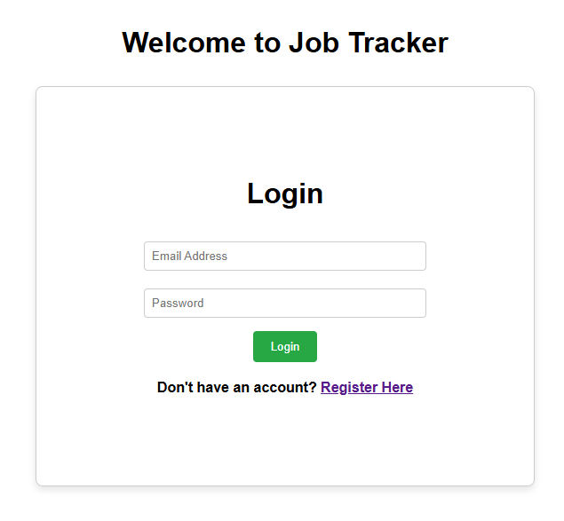
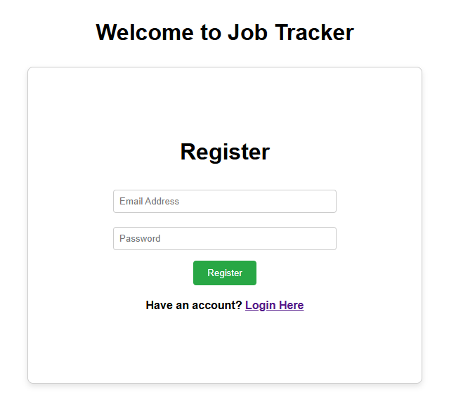
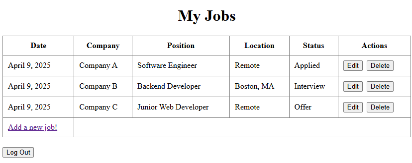
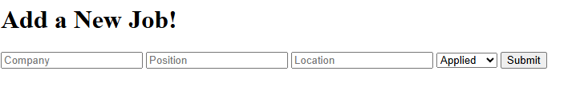
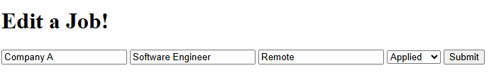

## Title: Job Tracker Web App

A full-stack web application for managing and tracking job applications. Built using Node.js, Express, MongoDB, Mongoose, EJS, and Passport.js, this project was designed to improve my skills in web development and demonstrate real-world functionality often seen in job-seeking platforms.

---

## Overview
The **Job Tracker** lets users:
- Register and log in with a secure session.
- Track and manage their job applications.
- View job application data in a clean and structured format.

This app fcuses on user authentication, RESTful routing, form handling, session management, and backend data persistence.

---

## Features

- User authentication using Passport.js and sessions.
- Secure login/registration system (with hashed passwords).
- RESTful routes for managing jobs and users.
- Server-side rendering with EJS.
- MongoDB integration for storing user and job data.
- Mongoose integration for MongoDB communication and custom schemas.
- MVC folder structure for clean and maintainable cose.

---

## Tech Stack

| Category       | Technology                  |
|----------------|-----------------------------|
| Frontend       | HTML, CSS, EJS              |
| Backend        | Node.js, Express            |
| Database       | MongoDB + Mongoose          |
| Auth           | Passport.js + express-session |
| Environment    | dotenv                      |

---

## Authentication

Users register and log in using their **email address**. Authentication is handled with Passport Local Strategy and sessions.

## To-Do and Future Improvements
- Add support for filtering and sorting jobs based on data, title, location, and position.
- Support for editing job fields on the Job's homepage.
- More job fields for storing notes and a link to the job posting.
- Improve the UI with more modern design libraries.
- Add unit/integration tests.

## Screenshots

<b>Login Page</b>

<b>Register Page</b>

  

<b>Jobs Homepage</b>

<b>Jobs Homepage</b>

<b>Jobs Homepage</b>

